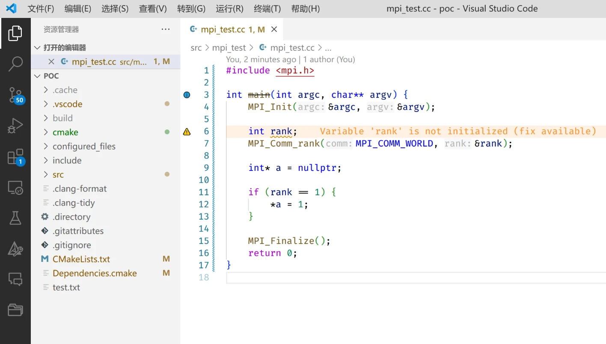
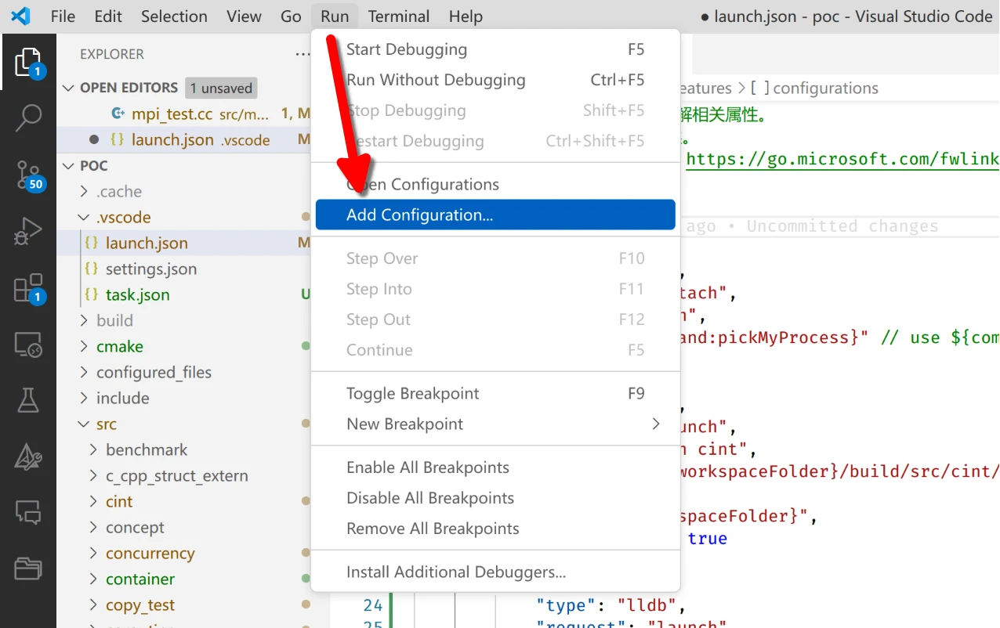
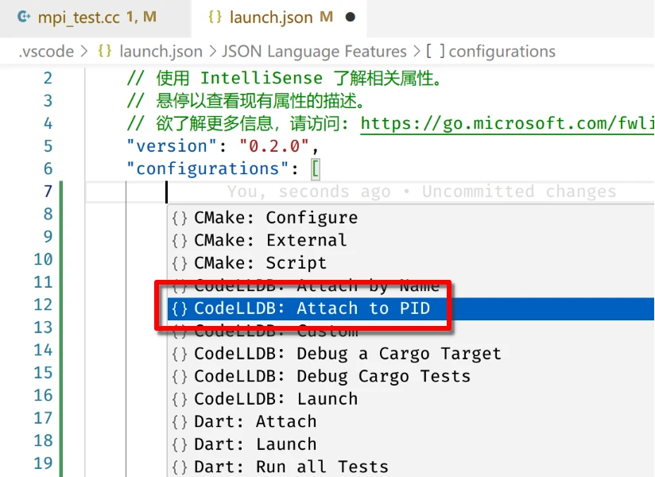
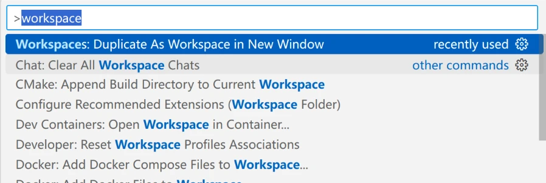
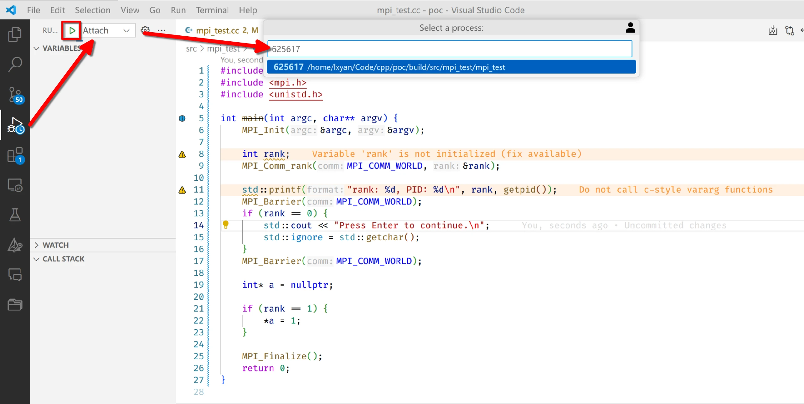
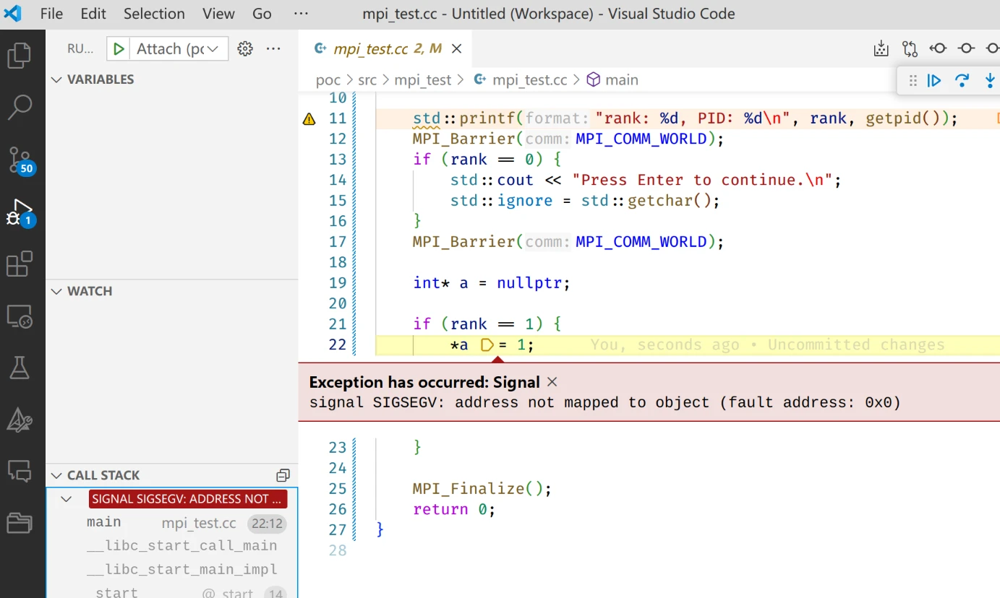

# Debug MPI program with VSCode GUI

Debugging MPI program is not easy. The most intended way can be found on [OpenMPI's documentation](https://docs.open-mpi.org/en/v5.0.x/app-debug/index.html), but it requires one to use command line tools (gdb) or learn new debugger (TotalView). In this article, I'll show you how to debug MPI program with VSCode GUI.

::: info
I only tested this on my own linux laptop and a linux cluster. It should work on windows with some modifications.

I originally learn this method from an article on [zhihu](https://www.zhihu.com) but I cannot find the original article. If you know the original author, please let me know.
:::

## Prerequisites

- VSCode installed
- VSCode plugin [CodeLLDB](https://marketplace.visualstudio.com/items?itemName=vadimcn.vscode-lldb) installed
    - I personally prefer LLVM toolchain. The [C/C++ tools plugin from microsoft](https://marketplace.visualstudio.com/items?itemName=ms-vscode.cpptools) works as well
- A MPI program compiled with debug information
    - if you use CMake, you should compile the program in `Debug` or `RelWithDebInfo` mode
    - if you use other build system, you should pass `-g` flag to the compiler. See [gcc's documentation](https://gcc.gnu.org/onlinedocs/gcc/Debugging-Options.html#index-g)

## Example

Suppose we have the following MPI program:

```cpp{12}
#include <mpi.h>

int main(int argc, char** argv) {
    MPI_Init(&argc, &argv);

    int rank;
    MPI_Comm_rank(MPI_COMM_WORLD, &rank);

    int* a = nullptr;

    if (rank == 1) {
        *a = 1; // we try to dereference a nullptr on rank 1
    }

    MPI_Finalize();
    return 0;
}
```

This is just a demonstration program. Real program can be more complex.

Compile and run this program with debug infomation, the prgram will crash, but the error message is not very helpful. 

```console
$ mpirun -np 2 /home/lxyan/Code/cpp/poc/build/src/mpi_test/mpi_test
[X1-Nano:591526] *** Process received signal ***
[X1-Nano:591526] Signal: Segmentation fault (11)
[X1-Nano:591526] Signal code: Address not mapped (1)
[X1-Nano:591526] Failing at address: (nil)
[X1-Nano:591526] [ 0] /lib/x86_64-linux-gnu/libc.so.6(+0x3c050)[0x7f10f865b050]
[X1-Nano:591526] [ 1] /home/lxyan/Code/cpp/poc/build/src/mpi_test/mpi_test(+0x1052f)[0x55d64801a52f]
[X1-Nano:591526] [ 2] /lib/x86_64-linux-gnu/libc.so.6(+0x2724a)[0x7f10f864624a]
[X1-Nano:591526] [ 3] /lib/x86_64-linux-gnu/libc.so.6(__libc_start_main+0x85)[0x7f10f8646305]
[X1-Nano:591526] [ 4] /home/lxyan/Code/cpp/poc/build/src/mpi_test/mpi_test(+0xdd41)[0x55d648017d41]
[X1-Nano:591526] *** End of error message ***
--------------------------------------------------------------------------
Primary job  terminated normally, but 1 process returned
a non-zero exit code. Per user-direction, the job has been aborted.
--------------------------------------------------------------------------
--------------------------------------------------------------------------
mpirun noticed that process rank 1 with PID 0 on node X1-Nano exited on signal 11 (Segmentation fault).
--------------------------------------------------------------------------
```

### Step 1: Start VSCode

Start VSCode and open the project folder containing the source code. In this example, the project folder is `/home/lxyan/Code/cpp/poc`.



### Step 2: Configure launch.json

Click the `Run` button on the top navigation bar, click `Add Configuration...`



Then select `CodeLLDB: Attach to PID`. If you use the `C/C++ tools` plugin, you should select `C/C++ (GDB): Attach`.



Finally, save and close the `launch.json` file.

### Step 3: Edit the program 

We need to edit the program to print its PID and wait for debugger to attach. Add the following code:

```cpp{2-3,11-17}
#include <mpi.h>
#include <cstdio>
#include <unistd.h>

int main(int argc, char** argv) {
    MPI_Init(&argc, &argv);

    int rank;
    MPI_Comm_rank(MPI_COMM_WORLD, &rank);

    std::printf("rank: %d, PID: %d\n", rank, getpid());
    MPI_Barrier(MPI_COMM_WORLD);
    if (rank == 0) {
        std::cout << "Press Enter to continue.\n";
        std::ignore = std::getchar();
    }
    MPI_Barrier(MPI_COMM_WORLD);

    int* a = nullptr;

    if (rank == 1) {
        *a = 1;
    }

    MPI_Finalize();
    return 0;
}
```

### Step 4: Duplicate workspace

Press `Ctrl + Shift + P` to open the command palette, type `workspaces`, and select `Duplicate as Workspace in New Window`.



Create as much workspace as the number of processes you want to debug. In this example, we have 2 processes, so we need to create 1 additional workspace.

Now, place two VSCode windows side by side.

### Step 5: Launch the program

Press Ctrl + \` to open the terminal in one vscode window, and run the program:

```console
$ mpirun -np 2 /home/lxyan/Code/cpp/poc/build/src/mpi_test/mpi_test
rank: 0, PID: 625617
rank: 1, PID: 625618
Press Enter to continue.
```

In this example, the PIDs are 625617 and 625618. Remember these PIDs.

### Step 6: Attach debugger

On the left VSCode window, click the `Debug` button on the left navigation bar, and select the `Attach` configuration you created in step 2. Click the green `Run` button, input the PID of the rank 0 (i.e. 625617).



On the right VSCode window, do the same thing, but input the PID of the rank 1 (i.e. 625618).

### Step 7: Debug

Now you can add break points and debug the program as usual. If you set break points on the left window, the program will stop at the break points on rank 0. If you set break points on the right window, the program will stop at the break points on rank 1.

Focus on the terminal, press `Enter` to continue the program. The program will stop at the break point you set, or stop at the crash point.



## Happy debugging!